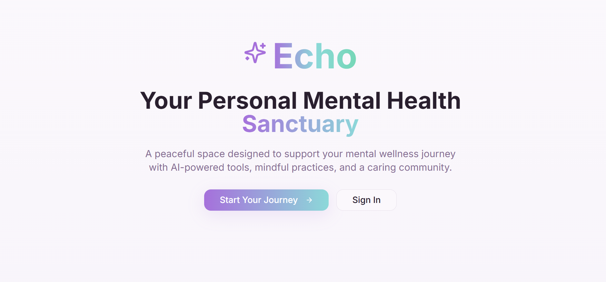
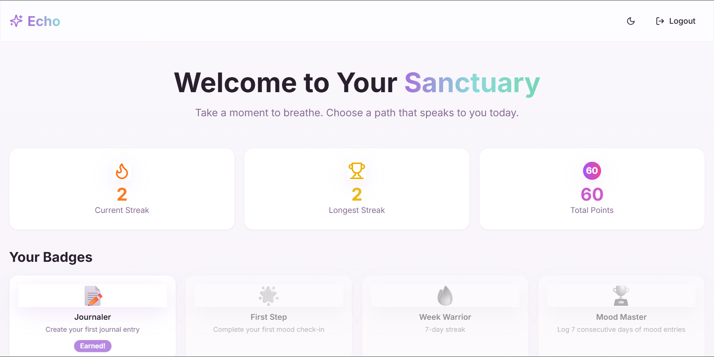

<!-- AIGNITE Banner (centered) -->

  <h1> AIGNITE 2K25</h1>
  
<strong>Powered by MLSC</strong>

---

  <strong>ECHO</strong> 
  <em>meet your innerself</em>

---

## 📖 Project Description
📖 Project Description

**✨ Problem Statement:**
Mental health support is often inaccessible, stigmatized, or lacks personalization. Many individuals struggle to find timely guidance, safe spaces to express emotions, or effective tools to track and improve their well-being.

**💡 Proposed Solution:**
Echo Zen Companion is an AI-driven mental health companion that provides empathetic conversations, guided mindfulness exercises, and mood tracking tools. It personalizes support based on user inputs and behavior, helping individuals manage stress, anxiety, and emotional well-being more effectively.

**🎯 Target Users / Use Cases:** 

• Students facing academic pressure who need emotional support.

• Working professionals dealing with stress or burnout.

• Individuals seeking daily mindfulness, journaling, and AI-powered wellness check-ins.

• Anyone who wants an accessible, stigma-free mental health tool.

---

## 🔬 Methodology

**1.Research & Ideation** – Studied mental health challenges and existing solutions; identified gaps in accessibility and personalization.

**2.Design** – Built wireframes, UI flows, and system architecture focusing on simplicity and empathy.

**3.Develop** – Implemented features like AI chatbot, mood tracker, mindfulness modules, and personalized recommendations.

**4.Test** – Conducted usability tests, iterated based on feedback, and refined chatbot responses.

**5.Deploy** – Hosted the platform for live demo and collected engagement metrics.

**6.Future Scope** – Expand with multi-language support, deeper analytics, integration with wearables, and advanced mental health insights.
---

## 👥 Team Details
**Team Name:** `ApexCoders`

| Name | Role | Email |
|---|---:|---|
| Shaik Afreen | Team Lead | 2511cs020694@mallareddyuniversity.ac.in |
| Nived P Pillai| Team Member | 2511cs020671@mallareddyuniversity.ac.in |
| Abdul sami   | Team Member| 2511cs020676@mallareddyuniversity.ac.in |
| Gowrav Vannan| Team Member | 2511cs020657@mallareddyuniversity.ac.in |

---

## 🛠️ Technology Stack  

- **Frontend:** `React` – Modern UI with responsive and interactive design.  
- **Backend:** `Node.js` – REST APIs for handling user requests and chatbot integration.  
- **Database & Auth:** `Firebase` – Real-time database, authentication, and secure storage.  
- **AI/ML Engine:** `Python` + `TensorFlow` – Powers the AI chatbot, sentiment analysis, and personalized recommendations.  
- **Hosting/Deployment:** `Firebase Hosting` / `Vercel` (for frontend) + `Render` / `Heroku` (for backend).  

---

## 📹 Demonstration Video
▶️ https://drive.google.com/file/d/10-k7JAChSnVSISgcUZPiXaddgTPUyUgu/view?usp=drive_link

---

## 🌐 Deployment
🔗 [Live Demo Link](#)

---

## 📚 References  

- [Firebase Documentation](https://firebase.google.com/docs) – For authentication, real-time database, and hosting setup.  
- [React Official Docs](https://react.dev/) – For building the frontend UI components.  
- [Node.js Documentation](https://nodejs.org/en/docs) – For backend server and API development.  
- [TensorFlow Documentation](https://www.tensorflow.org/) – For AI/ML model development and integration.  
- [MDN Web Docs](https://developer.mozilla.org/) – General reference for JavaScript, CSS, and web standards.  

---

## 🖼️ Assets / Screenshots

   
  

---

  <b>Hackathon:</b> AIGNITE 2K25 | Organized by MLSC 

